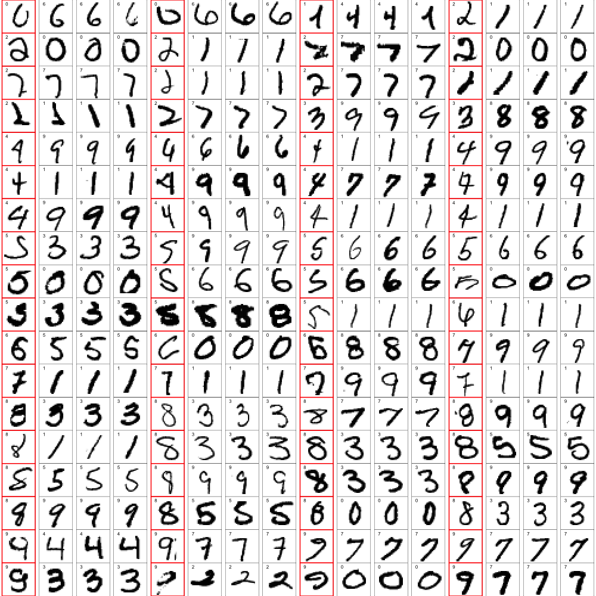
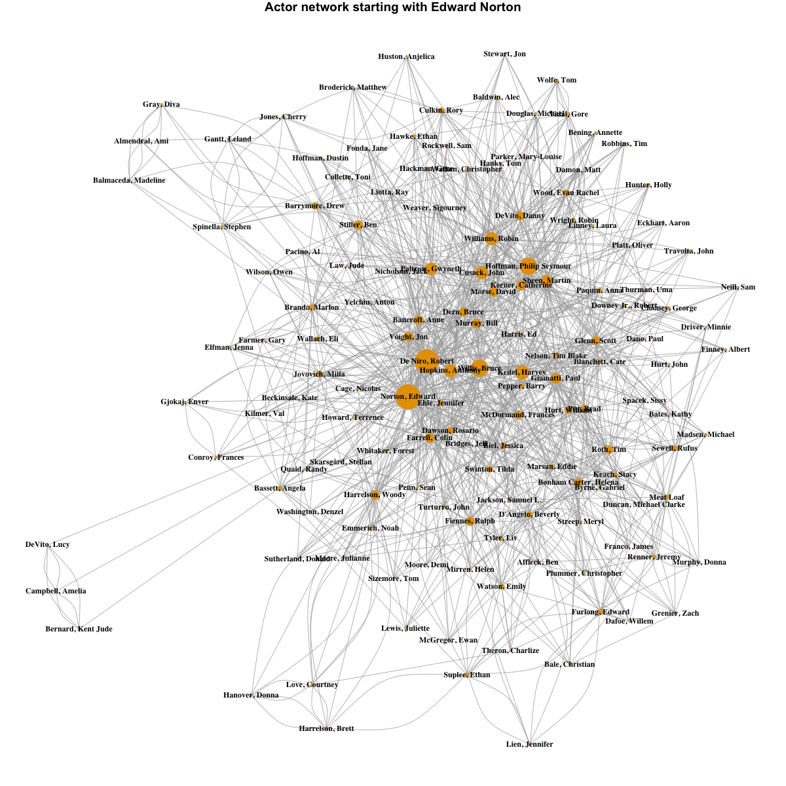
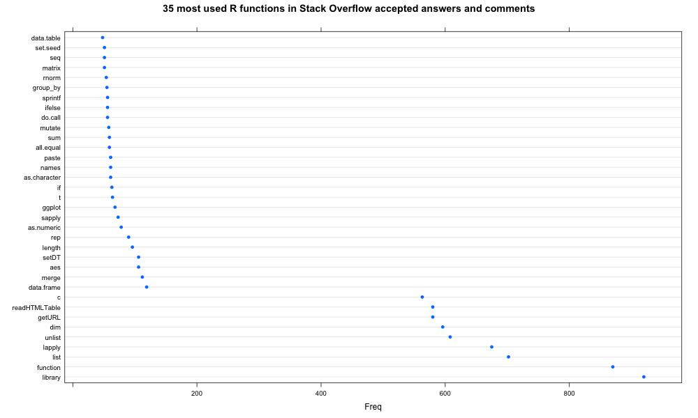

# Overview

Collection of several smaller projects using R.

## *k*-Nearest Neighbors

This algorithm uses a clever approach which makes it much faster than typical R implementations. A standard approach might use the *cvTools* and *class* libraries along with <code>cvFolds()</code> and <code>knn()</code> functions. However, this approach requires computing the same distance between digits numerous times. If we then wish to vary *k* (the number of nearest neighbors used for classification), we'll need to compute these same distances once again.

We can be much more efficient by first computing the distance matrix (distance between all pairs of digits) using the <code>dist()</code> function in R. We'll compute and save the distance matrix for each distance metric of interest: *euclidean*, *canberra*, *manhattan*, *cosine similarity*, etc. For cross-validation, we simply keep track of the indices of the training set for each CV fold, and classify the unknown test set digits.

The file `k_nearest_neighbor.Rmd` contains all the details, but one interesting finding relates to the residuals.  We identified digits in which the three nearest neighbors are all the same yet we have a misclassification. The plot below shows the original digit highlighted with a red box and shows the three nearest neighbors (plotted as the next three images to the right of each red box). For identification purposes, the upper left corner of each image shows the true digit label. These residuals give insight into why some of these digits were misclassified using this algorithm.

## IMDB Database Exploration

The IMDB data was created using the <a href='http://imdbpy.sourceforge.net/'>imdbpy</a> scripts. The code and results in `sql_databases.Rmd` explores this data using the *RSQLite* library from R. We conducted a brief network analysis using *igraph*. The plot below shows an actor network beginning with Edward Norton. Nodes represent actors with an edge connecting actors who have appeared in a movie together. We also made the size of the node proportional to its degree, and hence its importance in the network. Not surprisingly, the most important nodes in the network are Edward Norton, Robert De Niro, Philip Seymour Hoffman, and Bruce Willis, all older movie stars who have worked with many different actors over the years. 

## Scraping Stack Overflow

The file `web_scraping.Rmd` contains all the R code and analysis. The main function in <code>scrape_stackoverflow()</code> takes a tag as input and scrapes all Stack Overflow posts containing this tag. We scraped 25,000 posts with the *r* tag and found the most used R functions in accepted answers and comments. We found a total of 863 functions, with nine functions: *library, function, list, lapply, unlist, dim, getURL, readHTMLTable,* and *c* used with much greater frequency than the rest. A dot plot showing the frequency of the top 35 most used functions is shown below.

## Text Processing

We used regular expressions to process the text from Craigslist vehicle posts data, in particular the unstructured text from the body of the post. We extracted data for *price, VIN, contact info (phone number / email), website, year,* and *vehicle model*. See `regular_expressions.Rmd` for further details including R code. 

## Data Processing

The code in `nasa_data.Rmd` processes and cleans NASA data files which use an unconventional structure. We then explored the geospatial weather data graphically.